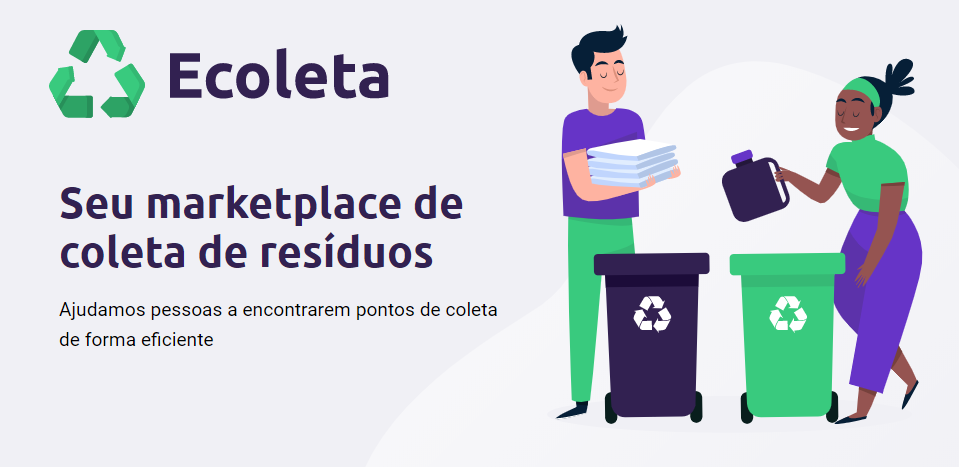

# **Ecoleta**
<p>uma solução que ajuda pessoas e empresas a encontrarem um ponto de coleta para materiais e resíduos para reciclagem de forma correta e segura para o meio ambiente</p>

<p align="center">
   
   
   <a href="https://www.linkedin.com/in/alexandrepasti/">
      
   </a>
   <a href="https://github.com/acpasti/ecoleta/commits/master">
      
   </a>
</p>

## Projeto
Esse probleto foi construido durante a semana do meio ambiente e na Next Level Week, uma jornada do desenvolvedor criada pela Rocketseat para distribuída pela Rocketseat.

<h1 align="center">
    
</h1>

## Tecnologias
### Frontend
#### Web
   - [ReactJS](https://reactjs.org/)
   - [TypeScript](https://www.typescriptlang.org/)
#### Mobile
   - [React Native](https://reactnative.dev/)
   - [TypeScript](https://www.typescriptlang.org/)
      
### Backend
   - [Node.js](https://nodejs.org/en/)
   - [TypeScript](https://www.typescriptlang.org/)

## Executando a aplicação

- ### **Pré-requisitos**

  - Possuir o **[Node.js](https://nodejs.org/en/)** instalado na máquina
  - Possuir um gerenciador de pacotes seja o **[NPM](https://www.npmjs.com/)** ou **[Yarn](https://yarnpkg.com/)**.
  - Possuir o **[Expo](https://expo.io/)** instalado de forma global na máquina

1. Faça um clone :

```sh
  $ git clone https://github.com/acpasti/ecoleta.git
```

2. Executando a Aplicação:

```sh
  # Instale as dependências
  $ npm install

  ## Crie o banco de dados
  $ cd server
  $ npm run knex:migrate
  $ npm run knex:seed

  # Inicie a API
  $ npm run dev

  # Inicie a aplicação web
  $ cd web
  $ npm start

  # Inicie a aplicação mobile
  $ cd mobile
  $ npm start
```

## License
Este projeto está sob a licença MIT. Veja o arquivo [LICENSE](LICENSE) para mais detalhes.
